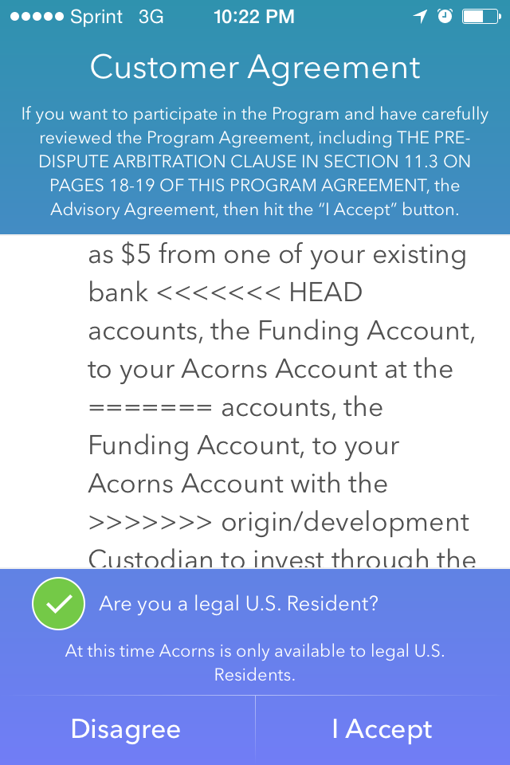

*topics:*

```
* git's staging area
* branching
* merging
  * merge conflicts
* force push
* stash
```

Interrupt with questions plz

---

*using the staging area*

Often beginners to git will simply `git add .`
and commit all changed files.

. . .

(IDEs often make this too easy)

However, it's a better practice to add selectively.

---

Let's look at how to inspect the staging area with

`git diff --cached`

. . .

and add to it one file at a time

`git add file.java`

. . .

or even one line at a time

`git add -p`

---

*branching*

Usually you spend your time on the default branch (called main or master)

but if you are going to do some work which is experimental, better to make a
__feature branch__.

. . .

Make a new branch like so:

```
$ git switch -c <name>
```

For example:

```
$ git switch -c java-21
```

---

You can see your current branch with

```
$ git status
```

and all local branches with

```
$ git branch
```

---

*merging*

Ok so now we have a couple branches. But they are kinda separate...

How to combine the changes from multiple branches? __git merge__!

```
$ git switch main
$ git merge Sensy-Things-and-Lights
```
(or simply)

```
$ git merge -
```

---

*OH SHooT!*

We got a gnarly __merge conflict__.

. . .

Inspect the wreckage with `git status`

you can always abandon the merge with `git merge --abort`

. . .

Let's look how to resolve a merge conflict in the terminal,
and in VS Code

. . .

take heart, merges are hard for even experienced programmers

---



---

*force push*

Another "oh shoot" moment: you accidentally pushed private information to the public!

It's already been published! But we can do sketchy stuff with __force push__.

```
$ git reset --hard @^
$ git push
<error>
$ git push --force-with-lease
<success>
```

🤔 why not `git push --force`?

Welcome to the _rough edges_ of git...

<https://stevelosh.com/blog/2013/04/git-koans/>

---

*git stash*

I don't recommend using this ;)

But it exists, and if you're left wondering

WHERE DID MY CHANGES GO !??!?

check the stash:

`git stash list`

`git stash show`

---

What I do instead: WIP commits

```
$ git add . && git commit -m 'wip working on space lazer'
```

that way the change stays on the branch. I can even push it to the remote at this point

<https://github.com/razzius/git-tricks>

---

fin. outline

> staging: git diff --cached, git add -p
> branches: git switch -c, git switch, git branch
> merging: git merge, git merge --abort, git reset --hard
> merge conflict: <<<< === >>>> exercise with poetry
> force push: don't do this
> stash: better not to use but it exists
